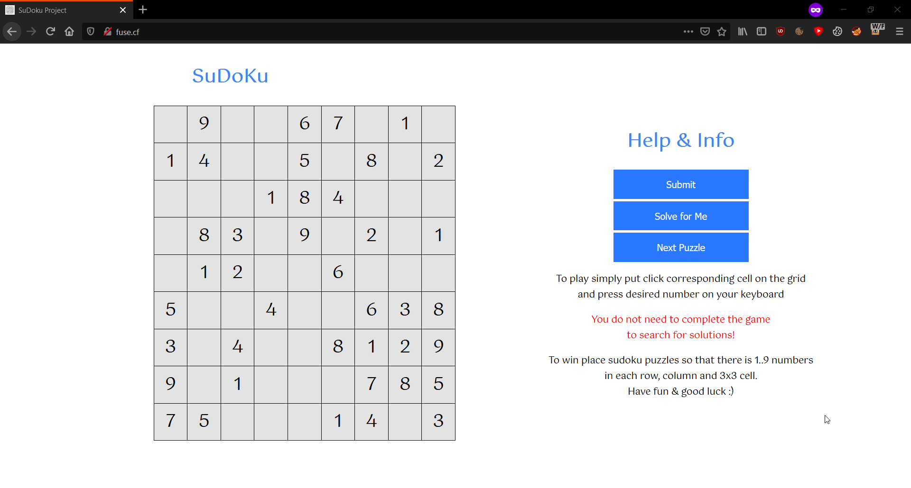

# SuDoKu Game
Made purely in JS/HTML/CSS/PYTHON with support for internet explorer 11, Firefox, Chrome and Safari.


# How to setup
```
git init
git pull https://github.com/michalani/SuDoKu.git
python3 -m venv venv
pip3 install -r requirements.txt
```

# How to run
```
cd intoTheProjectDirectory
venv/Scripts/activate
python3 api.py
open in browser http://127.0.0.1
```