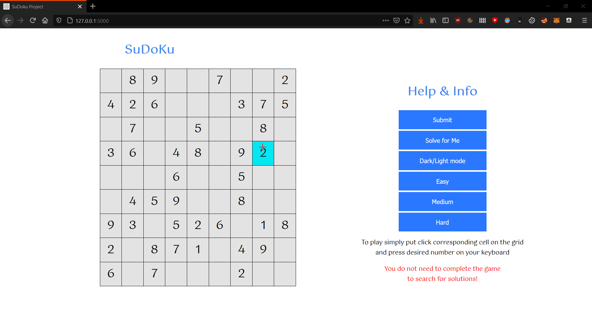

# SuDoKu Game
Made purely in JS/HTML/CSS/PYTHON with support for Firefox, Chrome and Safari.


# How to setup on Windows
```
git init
git pull https://github.com/michalani/SuDoKu.git
python3 -m venv venv
venv\Scripts\activate
pip3 install -r requirements.txt
```

# How to run on Windows (localy)
```
venv\Scripts\activate
python3 api.py
open in browser http://<SERVERIP>:5000/
```

# How to setup on Linux
```
sudo apt-get install python3 python3-venv git -y
git init
git pull https://github.com/michalani/SuDoKu.git
python3 -m venv venv
source venv/bin/activate
pip3 install -r requirements.txt
```

# How to run Linux (local or on server)
If you want to run it on a server please keep in mind that you will also have to change the serverDomain var in static/game.pretty.js 
```
export FLASK_APP=API.py
nohup flask run --host=<SERVERIP> --port=80
open in browser http://<SERVERIP>/
```

# API requests [GET]
```
. <= represents 0
To request API to solve a puzzle
http://127.0.0.1:5000/solve?puzzle=....8.9716.34.7852798..134643....5....71..43.5.2349.1.3...1...4..59..163..6.3....

To check whether puzzle was correctly solved
http://127.0.0.1:5000/valid?puzzle=254683971613497852798251346431768529967125438582349617329516784845972163176834295

To generate a board with upto removeCells worth of cells removed from the board
http://127.0.0.1:5000/new?removeCells=40

```